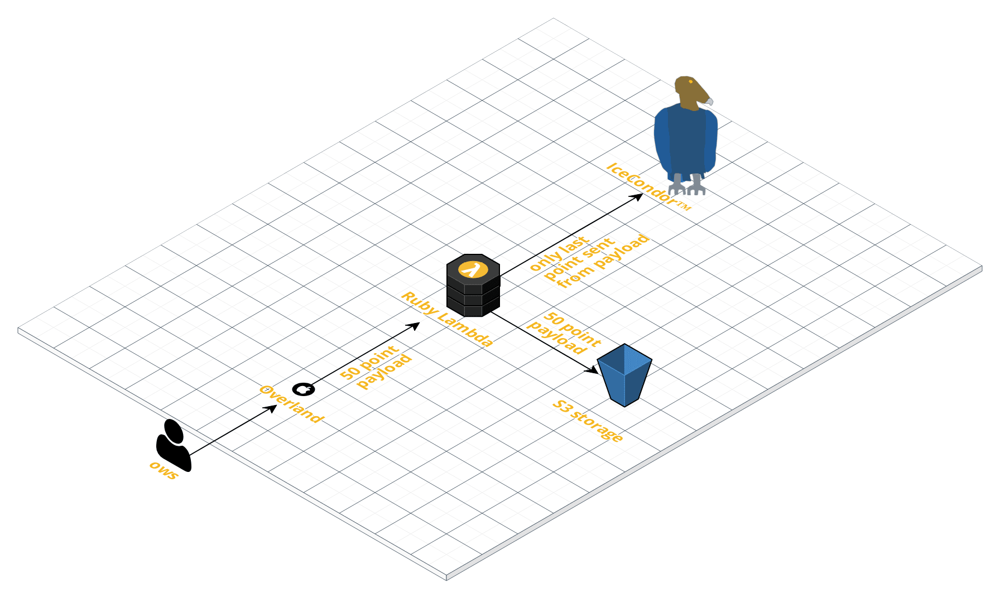

# tail-feathers

##### Description
A proxy for taking data from overland, dumping it into an S3 bucket, then pushing the last point over to Ice Condor™

##### Configuration

You'll need an s3 bucket your lambda has rights to write to, and an Ice Condor key.  Shove those into the lambda configuration in the `bucket` and `ic_token` env vars respectively.

##### Deployment 

First you have to zip up your artifact-

`zip -r func.zip *`

Then update the lambda code (create on the first one):
`aws lambda update-function-code --function-name myFunctionName --zip-file fileb://func.zip --profile appropriate-profile`

Each lambda in this repo is handled separately.
